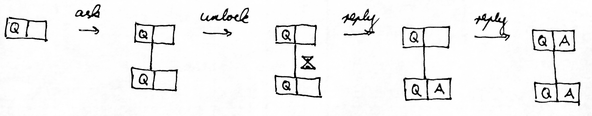
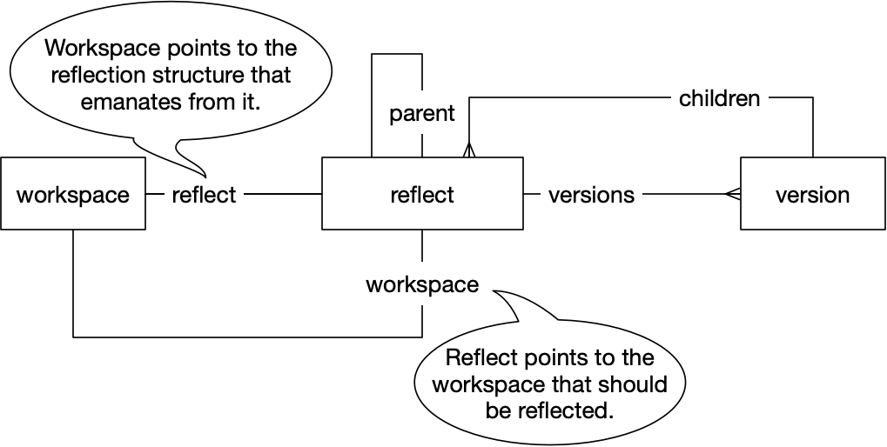

# Implementation tidbits

## Data model

- For each root question, the database contains a tree of workspaces, pointers,
  hypertext, reflects and versions.

- The commands Ask, Unlock, Reply correspond to transformations of this tree.

    

- When the user enters a command, Jursey generates transaction data that
  implement the transformation. Datomic updates the database according to the
  transaction data.

- A command together with its argument is an action. Each transaction is
  annotated with the action that caused it.

- Datomic retains each version of the tree, so one can go back in time, which is
  helpful for implementing reflection.

- No ‘mutable’ data is shared. In Patchwork one workspace Wp's sub-question SQ
  would be the same hypertext object as another workspace Wc's question Q.
  Conversely, Wc's answer would be the same hypertext as Wp's sub-answer. Since
  we want to be able to unlock a pointer in Q without affecting SQ, Patchwork
  has contexts around workspaces to keep track of pointer state.

  Jursey does away with that by having separate hypertexts. When I ask a
  question, it creates two copies. One becomes the sub-question of the current
  workspace, the other the question of the child workspace.

- Reflected workspaces are immutable and can therefore be shared. Reflection
  means showing ‘a photograph’ of a workspace as a user originally saw it. It is
  not possible to unlock pointers or take an action in the reflected workspace.


## Algorithms

- The core of Jursey consists of two big parts:
    - Part A: Given a workspace ID, get all data about this workspace from the
      database, then render this data to show it to the user.
    - Part B: Given the background data of a workspace, the DB (which is
      immutable) and an action from the user, generate transaction data to
      update the DB.

- In part A, the getting and rendering of data are recursive algorithms that
  follow the tree structure.

- Pointer names are local and the user refers to a pointer by its path. For
  example, "q.0.0" for nested hypertext no. 0 in nested hypertext no. 0 in the
  current workspace's question. This might make Jursey less user friendly, but
  it's easier algorithmically, because one can just go down the tree without
  caring what is around.

- Each workspace has two in-memory representations: a background data structure
  and what is shown to the user. The background data structure is the basis for
  rendering and it contains information for translating pointer paths to entity
  IDs.

- User interaction relies on the Clojure REPL. This way I didn't have to
  implement a command line interface. The output consists of plain data
  structures. This way I can let the built-in the pretty-printer do most of the
  formatting.


## Reflection

- *Computation Graph*  When you look at the database, you see one tree for every
  root question. At the highest level the nodes of such a tree are workspaces.
  Also stored ‘below the surface’ of the database are the previous versions of
  this tree. Now imagine that there are directed edges from each workspace to
  its earlier versions, to its parent and to its children. This is the
  computation graph.

  Every workspace is transitively connected to everything that had an influence
  on it. Each such subtree, rooted in a workspace, can become a shadow
  reflection tree in the UI.

- *Shadow Graph*  The shadow graph is a user interface concept that I just
  invented. It is a graph whose contents lie in the shadows. The user can turn
  on the light node by node to make the contents visible. Hypertext and
  reflection output both are shadow trees and unlocking entries corresponds to
  turning on the light. However, they are represented differently in the
  database.
  - For the hypertext shadow tree, all nodes already exist in the database.
    Turning on the light corresponds to switching a pointer from `:locked? true`
    to `:locked? false`.
      ```
      DB:
      {:content "What is the capital of $0?"
       :pointers {"0" {:content "Texas"
                       :locked? true}}}
      UI: "What is the capital of $0?"

      (unlock "….0")→

      DB:
      {:content "What is the capital of $0?"
       :pointers {"0" {:content "Texas"
                       :locked? false}}}
      UI: "What is the capital of [0: Texas]?"
      ```

  - For the reflection shadow tree, the nodes in the database specify which
    other parts of the database to shine the light on:
      ```
      DB:
      {:db/id n
       :ws/reflect {:reflect/ws n}}
       ;;                       ↑ Shine a light on what is next to this workspace.
      UI:
      {"r" {:max-v 3, "parent" :locked}}
      ```
    If I want the light to be switched on somewhere, I need to add a node to the
    reflection structure in the database:
      ```
      (unlock "r.2")→

      DB:
      {:db/id n
       :ws/reflect {:reflect/ws n
                    :reflect/version {:version/number 2
       ;; Now also shine a light on this version.     ↑
                                      :version/tx …}}
      UI:
      {"r" {:max-v 3
            "parent" :locked
            "2" {"ws" {…}
                 "children" {…}
                 "act" […]}
      ```

- The entity types are related thus:

  

- Reachability is implemented using datomic `as-of` DBs, ie. views that only
  contain data until a certain transaction.
